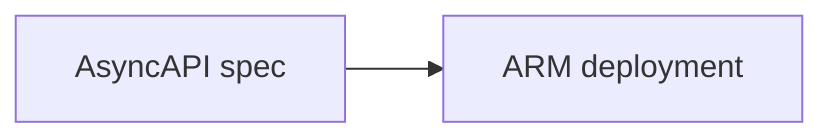

# azure-servicebus-template
AsyncAPI generator for service bus topologies

The AsyncAPI spec is an emerging standard for defining message-based services in a vendor-agnostic specification, similar to what OpenAPI provides for HTTP-oriented services. Traditionally an Azure Service Bus topology can only be defined in a proprietary ARM format, such as an ARM deployment, which has limited use outside the Azure ecosystem. Utilizing a vendor-agnostic specification enables interoperability with a broader ecosystem for tooling and documentation.

## Initial Goals
This project being hacked to life as part of the Microsoft Hackathon 2022 with a few initial goals:

* Parse the AsyncAPI specification into an object model that can be used to generate other specifications (such as an ARM deployment).
* Generate an ARM deployment specification for a service bus topology (namespace, topics, subscriptions, and queues) from an AsyncAPI specification.
* Tests and documentation of this usage

## Stretch goals
It's possible we reach these goals and want to reach further, so here are some stretch goals.

* Publish a nuget package for easy consumption by the community.
* Inspect a service bus namespace and generate an AsyncAPI specification.
* Generate stub code for processing messages with the Azure.ServiceBus.Messaging SDK. 
* Generate an AsyncAPI specification from a service bus definition in [Farmer](https://compositionalit.github.io/farmer/).
